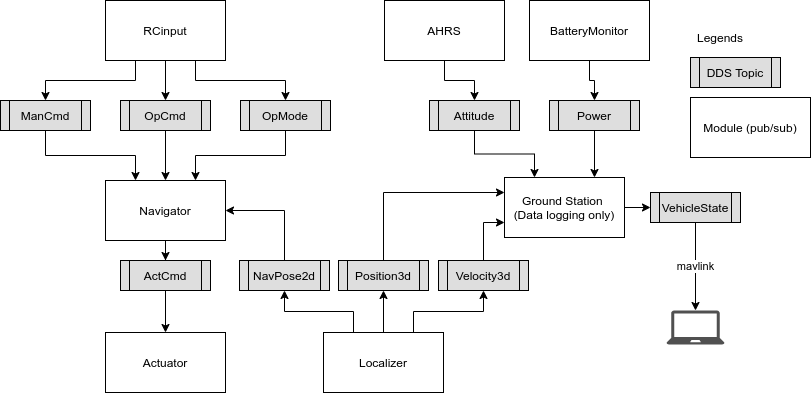

# RoverBot autopilot



We use FastDDS to handle communications among modules.

# Dependency

## Eigen3
```bash
git clone https://gitlab.com/libeigen/eigen.git
cd eigen && mkdir build && cd build
cmake ..
sudo make install
```
* the above operations will install header lib at: `/usr/local/include/eigen3`
* you should do: `export EIGEN3_INCLUDE_DIR=/usr/local/include`
    * TODO: we should remove this env variable when all platforms install Eigen using the above method, and `/usr/local/include` is in path by default.

## Realsense
Install the sdk according to [Official Guide](https://github.com/IntelRealSense/librealsense/tree/master/doc)
* _note_: follow instructions for your specific system.
    * [Ubuntu](https://github.com/IntelRealSense/librealsense/blob/master/doc/distribution_linux.md)
    * [Raspbian](https://github.com/IntelRealSense/librealsense/blob/master/doc/installation_raspbian.md)
    * [Raspbian (4.19 + RPi 4)]
      
      Run the [`install_realsense_2_39_0.sh`](./install_realsense_2_39_0.sh) script

## FastDDS

Dependency:
* Asio, TinyXML2
```bash
sudo apt install libasio-dev libtinyxml2-dev
```

Please use manual installation:

Before compiling manually Fast DDS you need to clone the following dependencies and compile them using
[CMake](https://cmake.org).

* [Fast CDR](https://github.com/eProsima/Fast-CDR.git)

    ```bash
    $ git clone https://github.com/eProsima/Fast-CDR.git
    $ mkdir Fast-CDR/build && cd Fast-CDR/build
    $ cmake ..
    $ sudo cmake --build . --target install
    ```

* [Foonathan memory](https://github.com/foonathan/memory)

    ```bash
    $ git clone https://github.com/eProsima/foonathan_memory_vendor.git
    $ cd foonathan_memory_vendor
    $ mkdir build && cd build
    $ cmake ..
    $ sudo cmake --build . --target install
    ```
* GCC requirements:
> On Rabian (RPI), we need to use GCC5 to compile FastDDS (newer GCC would generate errors):
> ```bash
> sudo apt-get install gcc-5 g++-5
> sudo update-alternatives --install /usr/bin/gcc gcc /usr/bin/gcc-5 60 --slave /usr/bin/g++ g++ /usr/bin/g++-5
> sudo update-alternatives --set gcc "/usr/bin/gcc-5"
> ```
* switch back to gcc-8 to compile RoverBot
> ```bash
> sudo update-alternatives --install /usr/bin/gcc gcc /usr/bin/gcc-8 60 --slave /usr/bin/g++ g++ /usr/bin/g++-8
> sudo update-alternatives --set gcc "/usr/bin/gcc-8"
> ```
> On Ubuntu, use the latest GCC to compiel FastDDS works fine!

Once all dependencies are installed, you will be able to compile and install Fast DDS.

```bash
$ git clone https://github.com/eProsima/Fast-DDS.git
$ mkdir Fast-DDS/build && cd Fast-DDS/build
$ cmake ..
$ sudo cmake --build . --target install
```

Next, install [Fast DDS-Gen](https://fast-dds.docs.eprosima.com/en/latest/installation/sources/sources_linux.html#fastddsgen-sl):
```bash
git clone --recursive https://github.com/eProsima/Fast-DDS-Gen.git
cd Fast-DDS-Gen
./gradlew assemble
```
After the above commands, there should be a Java application genreated at `./share/fastddsgen/java/fastddsgen.jar` and an executable script at `./scripts/fastddsgen`. 

Add the script's directory to the system's environment variable `PATH` to make the script accessible golablly.

# Building

## CMake version

Requires CMake > 3.12.4:
```bash
sudo apt purge cmake
wget https://github.com/Kitware/CMake/releases/download/v3.13.4/cmake-3.13.4.tar.gz
tar zxf cmake-3.13.4.tar.gz
cd cmake-3.13.4
sudo ./bootstrap
sudo make
sudo make install
sudo sudo ln -s /usr/local/bin/cmake /usr/bin/cmake
cmake --version
```

_note_: IDL types need to be processed to get C++ classes. This step should have been performed by the developer before updated IDL src files are checked in. To regenerate C++ classes:
```bash
cd IDL
./dds-regen.sh
```

To build RoverBot
```
mkdir build
cd build
cmake ..
make install
```
* remember to switch gcc/g++ version to 8 on RPI: 
```bash
VERSION=8
sudo rm /usr/bin/gcc
sudo ln /usr/bin/"gcc-$VERSION" /usr/bin/gcc
sudo rm /usr/bin/g++
sudo ln /usr/bin/"g++-$VERSION" /usr/bin/g++
```

# Running

## Run RoverBot:
Inside install folder, use the [`runAll.sh`](./runAll.sh) script to launch all DDS processes.

## Demo
[Video on YouTube]()


# Profiling for single process app
```
mkdir build
cd build
cmake -DCMAKE_CXX_FLAGS=-pg -DCMAKE_EXE_LINKER_FLAGS=-pg -DCMAKE_SHARED_LINKER_FLAGS=-pg ..
make
# run app with profiling on
sudo ./RoverBot -g [ground control IP running a mavlink-based ground station app (e.g. ggroundcontrol)] -hz [app loop spped, hertz] -t [waypoint reach tolerance, meters]
# generate report
sudo gprof ./RoverBot gmon.out > analysis.txt --line
```
